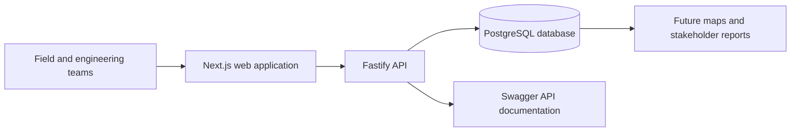

# Fiber Ops

Fiber Ops is a field-oriented fiber infrastructure management platform for Intelligent Transportation Systems (ITS). It connects engineering design, field installation, commissioning, and long-term maintenance records in one structured model.

## Why it exists

Fiber infrastructure records are often split across plan sheets, splice diagrams, spreadsheets, test files, field notes, and institutional knowledge. Fiber Ops is intended to create a durable operational record that helps teams answer:

- What infrastructure belongs to this project?
- Where is each cabinet, ground box, pole, building, or splice closure?
- Which cables and fiber strands connect those locations?
- How are strands spliced through trays and closures?
- Can a technician trace continuity from one end of a circuit to the other?

## Current capabilities

- Project inventory and project summaries
- Node records for cabinets, splice closures, ground boxes, poles, and buildings
- GPS-ready node metadata, mile markers, notes, and field-location context
- Backbone, spur, and drop cable records
- Automatic fiber-strand generation using the standard 12-color sequence
- Fiber status tracking for dark, lit, reserved, and broken strands
- Splice tray and bulk splice records
- Fiber continuity tracing through recorded splices
- Interactive API documentation through Swagger UI
- Project dashboard for nodes, cables, and total fiber counts

## System overview

## Technology

| Layer | Technology | Responsibility |
|---|---|---|
| Frontend | Next.js, React, TypeScript | Project and field-oriented user interface |
| Backend | Fastify, TypeScript, Zod | API, validation, and business rules |
| Data access | Prisma | Relational data model and persistence |
| Database | PostgreSQL | Projects, assets, cables, fibers, trays, and splices |
| API documentation | OpenAPI and Swagger UI | Interactive endpoint reference |

## Documentation

- [Documentation index](docs/README.md)
- [Stakeholder overview](docs/stakeholder-overview.md)
- [Requirements and traceability](docs/requirements.md)
- [Architecture and data model](docs/architecture.md)
- [SDLC and change workflow](docs/sdlc.md)
- [Architecture Decision Record template](docs/templates/adr-template.md)
- [Release note template](docs/templates/release-note-template.md)

## Status

Fiber Ops is in active development. The current implementation establishes the core domain model and field inventory workflow. Map-based asset views, richer reporting, authentication, import/export workflows, and production deployment controls remain planned work.

