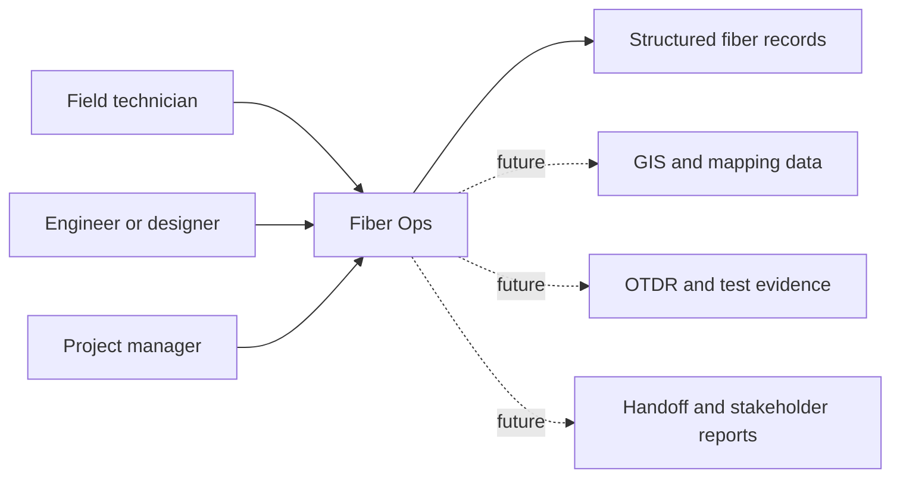
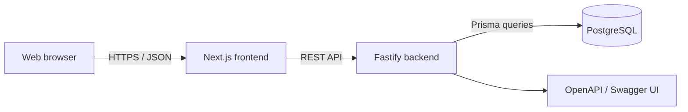
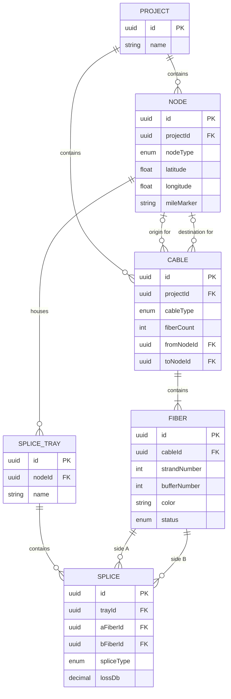
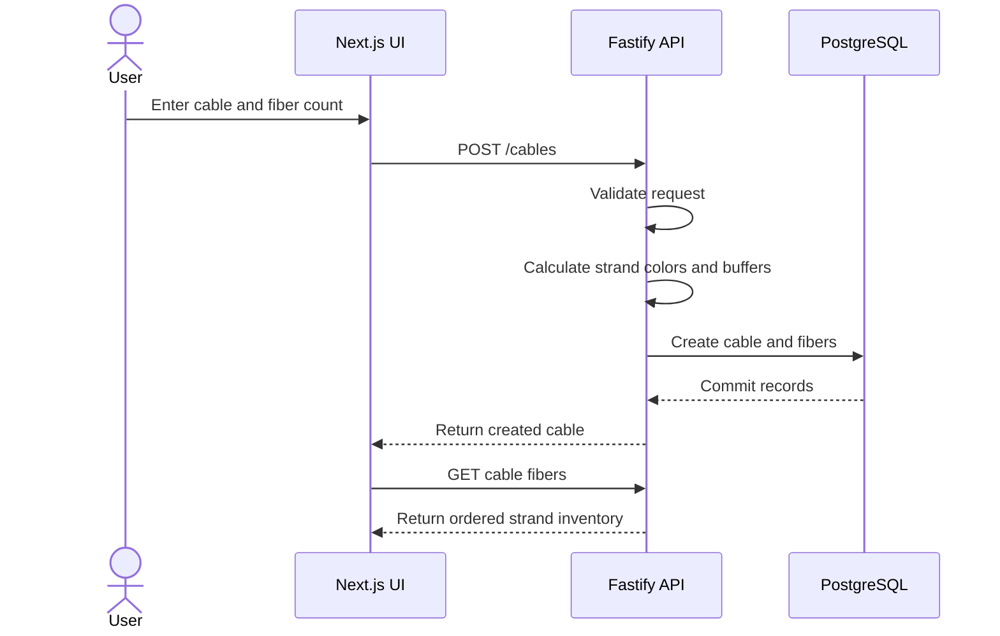

# Fiber Ops Architecture and Data Model

## Architectural goals

Fiber Ops uses a conventional web architecture so domain rules remain centralized, data stays relational, and the user interface can evolve independently from persistence.

The architecture prioritizes:

- A domain model that resembles real fiber infrastructure
- Validation at the API boundary
- Traceable relationships between assets, cables, fibers, trays, and splices
- A field-oriented web interface
- Future integration with mapping, testing, and reporting workflows

## System context

## Application containers

| Component | Current responsibility |
|---|---|
| Next.js frontend | Displays projects and project summaries; manages node and cable workflows; displays generated fibers |
| Fastify backend | Exposes REST endpoints, validates input, applies fiber generation and trace rules |
| Prisma | Maps domain entities and relationships to PostgreSQL |
| PostgreSQL | Stores durable project and fiber-topology records |
| Swagger UI | Provides an interactive developer reference for API behavior |

## Domain model

## Cable creation sequence

Creating a cable also creates its strand inventory. The backend, rather than the browser, owns this rule so every client receives consistent results.

## Fiber continuity trace

The trace endpoint performs a bounded graph traversal. It starts from a fiber, finds splices connected to either splice side, and follows unvisited fibers until the path is exhausted or the safety limit is reached.

This is a useful operational capability, but its accuracy depends entirely on the completeness and correctness of recorded splice relationships.

## Current architectural risks and gaps

| Area | Current gap | Why it matters |
|---|---|---|
| Authentication | No production identity or role model documented | Infrastructure records require controlled access |
| Audit trail | Record-level change history is not yet modeled | As-built changes need accountability |
| Testing | Backend package does not yet define automated tests | Domain rules need repeatable verification |
| Deployment | Production topology and environment controls are not documented | Stakeholders need support and recovery expectations |
| GIS integration | Location data exists without a map integration contract | Spatial workflows remain incomplete |
| Test evidence | OTDR and acceptance results are not modeled | Operational records cannot yet show measured condition |
| API organization | Current routes are concentrated in the main server file | Continued growth will increase maintenance cost |

## Decision records

Use [the ADR template](templates/adr-template.md) for decisions that affect data shape, security, integrations, deployment, or long-term maintenance. ADRs document why a choice was made; they do not replace implementation details or requirements.

