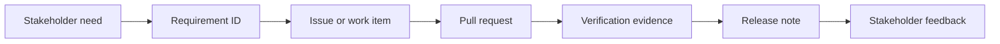

# Fiber Ops Requirements and Traceability

## Status vocabulary

- **Implemented:** Present in the current application or API.
- **Partial:** Some supporting behavior exists, but the full stakeholder workflow is incomplete.
- **Planned:** Accepted product direction without a completed implementation.
- **Proposed:** Requires stakeholder agreement before becoming committed scope.

## Functional requirements

| ID | Requirement | Status | Current evidence |
|---|---|---|---|
| FO-FR-001 | The system shall create, list, rename, summarize, and delete projects. | Implemented | Project API routes and project dashboard |
| FO-FR-002 | The system shall record nodes belonging to a project. | Implemented | Node model and node CRUD API |
| FO-FR-003 | A node shall support cabinet, splice closure, ground box/handhole, pole, and building classifications. | Implemented | `NodeType` domain values |
| FO-FR-004 | A node shall support latitude, longitude, capture source, accuracy, capture time, mile marker, and notes. | Partial | Data model and API are available; complete field capture workflow is planned |
| FO-FR-005 | The system shall record backbone, spur, and drop cables between optional origin and destination nodes. | Implemented | Cable model, API, and project UI |
| FO-FR-006 | Creating a cable shall generate the requested number of individual fiber records. | Implemented | Cable creation rule in the backend |
| FO-FR-007 | Generated fibers shall follow the standard repeating 12-color sequence and buffer numbering. | Implemented | Strand color and buffer generation logic |
| FO-FR-008 | A fiber shall support dark, lit, reserved, and broken status values. | Implemented | `FiberStatus` domain values |
| FO-FR-009 | Users shall be able to review fibers grouped by cable and buffer. | Implemented | Project fiber viewer |
| FO-FR-010 | The system shall record splice trays at eligible nodes. | Partial | Backend routes and data model are available; complete UI is planned |
| FO-FR-011 | The system shall record bulk fusion or mechanical splice relationships between fibers. | Partial | Transactional bulk-splice API is available; complete UI is planned |
| FO-FR-012 | The system shall trace connected fibers through recorded splice relationships. | Partial | Trace API is available; stakeholder-facing visualization is planned |
| FO-FR-013 | The system shall provide a project summary of nodes, cables, and total fiber capacity. | Implemented | Project summary API and dashboard |
| FO-FR-014 | The system shall expose interactive API documentation. | Implemented | Swagger UI at `/docs` |
| FO-FR-015 | The system shall provide a spatial map or corridor view of project assets. | Planned | Roadmap item |
| FO-FR-016 | The system shall associate test evidence, including OTDR results, with the applicable project, cable, or strand. | Planned | Roadmap item |
| FO-FR-017 | The system shall produce stakeholder and maintenance handoff reports. | Planned | Roadmap item |
| FO-FR-018 | The system shall import and export approved project data formats. | Proposed | Stakeholder format and governance decisions required |

## Non-functional requirements

| ID | Requirement | Status |
|---|---|---|
| FO-NFR-001 | API inputs shall be validated before database operations. | Implemented with Zod validation |
| FO-NFR-002 | Referential rules shall prevent or explicitly handle orphaned project data. | Implemented through relational constraints and delete behavior |
| FO-NFR-003 | Multi-record splice creation shall complete transactionally. | Implemented |
| FO-NFR-004 | The system shall protect project data through authentication and role-based authorization before production deployment. | Planned |
| FO-NFR-005 | Production changes shall be auditable by user, time, and affected record. | Planned |
| FO-NFR-006 | The system shall support backup and tested restoration of production data. | Planned |
| FO-NFR-007 | Stakeholder-facing pages shall remain usable on common field laptops and tablets. | Proposed; target devices require confirmation |
| FO-NFR-008 | Sensitive infrastructure information shall be handled according to organizational and customer requirements. | Proposed; governance review required |
| FO-NFR-009 | User-facing features shall include documented acceptance criteria and verification evidence. | Process requirement established by [SDLC workflow](sdlc.md) |

## Requirement-to-release traceability

Every material feature should carry its requirement ID through planning, implementation, testing, and release documentation.



Example:

```text
FO-FR-012
  -> issue: Add continuity trace visualization
  -> pull request: agent/fiber-trace-view
  -> test: trace a known two-splice path and verify every hop
  -> release: v0.x fiber trace visualization
  -> feedback: field technician review
```

## Updating requirements

- Add or revise requirements when scope changes.
- Do not silently change the meaning of an accepted requirement.
- Mark assumptions and proposals clearly until a stakeholder approves them.
- Record consequential technical choices in an Architecture Decision Record.
- Reference affected requirement IDs in pull requests and release notes.

