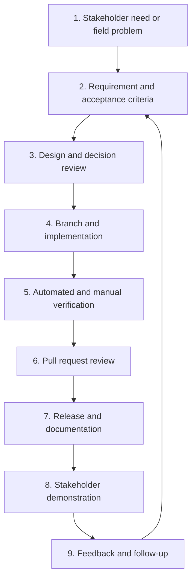

# Fiber Ops SDLC and Change Workflow

## Purpose

This workflow keeps product intent, implementation, validation, and stakeholder communication connected. It is intentionally lightweight enough for active development while establishing the documentation habits expected in a professional software development lifecycle.

## Change lifecycle



## Required artifacts by stage

| Stage | Minimum artifact | Key question |
|---|---|---|
| Intake | Problem statement | What field or business problem are we solving? |
| Requirements | Requirement ID and acceptance criteria | What observable behavior proves success? |
| Design | Diagram or ADR when warranted | How will the change fit the system? |
| Build | Focused branch and commits | Is the implementation limited to the agreed scope? |
| Verification | Test results and manual checks | What evidence shows the behavior works? |
| Review | Pull request summary | Can another person understand the change and risk? |
| Release | Release note | What changed for users and operators? |
| Demonstration | Stakeholder scenario | Can the outcome be shown using a realistic workflow? |
| Feedback | Decision or follow-up issue | What did stakeholders accept, reject, or request? |

## Definition of Ready

A feature is ready for implementation when:

- The problem and intended user are identified.
- The relevant requirement ID exists.
- Acceptance criteria describe observable outcomes.
- Dependencies, data changes, and security concerns are understood.
- Mockups or diagrams exist when they materially reduce ambiguity.
- Open stakeholder decisions are either resolved or clearly documented.

## Definition of Done

A feature is done when:

- The implementation satisfies its acceptance criteria.
- Relevant automated checks pass.
- Manual verification is documented for behavior not covered automatically.
- Error and empty states have been considered.
- Security and data-handling impacts have been reviewed.
- Requirements, architecture, or API documentation is updated when affected.
- A release note explains user impact.
- Known limitations and follow-up work are recorded.

## Branch and pull request conventions

- Start feature branches from the active development branch.
- Use a focused name such as `agent/fiber-trace-view` or `feature/map-location-capture`.
- Keep unrelated changes out of the same pull request.
- Reference requirement IDs in the pull request body.
- Include screenshots or diagrams for visible workflow changes.
- Use draft pull requests while work or verification remains incomplete.
- Merge only after scope and verification evidence are understandable to another reviewer.

## Acceptance criteria format

Use scenario language when behavior depends on conditions:

```text
Given a project contains a 144-fiber backbone cable
When a user opens the cable's strand inventory
Then 144 fibers are listed in strand order
And each fiber displays its buffer number, color, and status
```

## Verification record

Each pull request should identify:

- Automated checks executed
- Manual scenarios exercised
- Test data or fixtures used
- Expected and actual results
- Known gaps that remain

Avoid including real credentials, customer data, or sensitive infrastructure records in screenshots and test fixtures.

## Stakeholder demonstration pattern

A short demonstration should tell one coherent story:

1. Start with the field or business problem.
2. Show the previous limitation.
3. Walk through the new workflow using representative data.
4. Show the resulting record, report, or decision.
5. State what is complete, what remains, and what feedback is needed.

## Documentation maintenance

- Requirements describe **what** the system must do.
- Architecture describes **how the system is organized**.
- ADRs explain **why an important technical choice was made**.
- Tests provide **evidence**.
- Release notes explain **what changed for users and operators**.
- Stakeholder updates explain **value, risk, and next decisions**.

Documentation should be updated in the same pull request as the behavior it describes.

