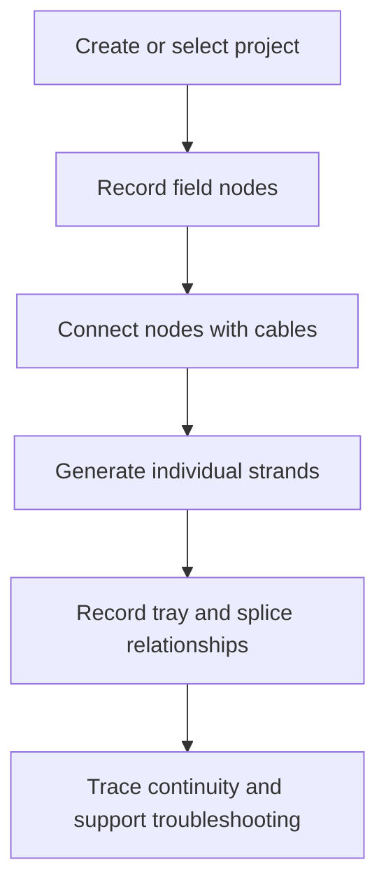

# Fiber Ops Stakeholder Overview

## Executive summary

Fiber Ops is a proposed system of record for fiber infrastructure used in ITS deployments. It models projects, field locations, cables, individual strands, splice trays, and splice relationships so engineering and field teams can work from the same operational picture.

The platform is intended to reduce time spent searching through disconnected plan sheets, spreadsheets, screenshots, and field notes. Its long-term value is faster asset location, clearer fiber continuity, better construction handoff, and more reliable maintenance records.

## Problem statement

Fiber documentation changes as a project moves from design to construction and commissioning. The final field condition may not perfectly match the original plans, and important details can remain scattered across several file types or with individual team members.

This creates recurring operational questions:

- Where is the asset actually located?
- Which cable reaches the site?
- Which strand and buffer are in use?
- Where was the strand spliced?
- What path should be checked during an outage?
- Does the maintenance record reflect the installed condition?

## Intended stakeholders

| Stakeholder | Primary need |
|---|---|
| Field technicians | Locate assets and trace physical connectivity during installation or troubleshooting |
| Project managers | Understand project inventory, completion status, and documentation gaps |
| Engineers and designers | Compare the modeled network with design intent and as-built conditions |
| Fiber splicers and testers | Record trays, strand relationships, splice loss, and test evidence |
| Maintenance teams | Preserve usable records after construction handoff |
| Leadership and customers | Review progress, risk, readiness, and measurable project outcomes |

## Expected outcomes

- A consistent inventory of fiber assets by project
- Better field findability through GPS-ready records and location context
- Strand-level visibility instead of cable-count-only tracking
- Repeatable continuity tracing through recorded splices
- Clear separation between installed facts, assumptions, and planned work
- Stakeholder reporting derived from structured data rather than manually rebuilt summaries

## Current product scope

The current implementation provides the core data model and API operations for projects, nodes, cables, fibers, splice trays, and splices. It also includes a web dashboard for project, node, cable, and fiber inventory.

## Product boundary

Fiber Ops should support operational decisions, but it does not replace sealed engineering drawings, contract documents, required test procedures, GIS systems of record, or formal as-built acceptance. Those sources remain authoritative until an approved governance process establishes otherwise.

## Roadmap themes

| Theme | Stakeholder value | Current state |
|---|---|---|
| Field location capture | Find cabinets, ground boxes, poles, and closures faster | Data fields available; richer capture UI planned |
| Map and corridor view | Understand assets spatially along a project | Planned |
| Splice workflow UI | Record and review strand connections without direct API use | Backend available; UI planned |
| OTDR and test evidence | Connect measured results to cables and strands | Planned |
| Reports and handoff packages | Present inventory, readiness, and exceptions | Planned |
| Authentication and roles | Protect project data and control changes | Planned |
| Import and export | Reuse existing spreadsheets, GIS data, and project records | Planned |

## Measures of success

Future releases should track outcomes such as:

- Percentage of nodes with verified location information
- Percentage of installed cables represented in the system
- Percentage of active strands with traceable endpoints
- Time required to locate an asset or identify a suspected fiber path
- Number of unresolved documentation exceptions at project handoff
- Time required to produce a stakeholder-ready project summary

## Stakeholder review questions

1. Which record should be authoritative when plans and field conditions disagree?
2. Who may create, approve, or revise as-built information?
3. Which project details are safe to store in a shared or cloud-hosted system?
4. Which reports are required for construction acceptance and maintenance handoff?
5. Which integrations provide the most value first: GIS, OTDR, spreadsheets, or asset-management systems?

